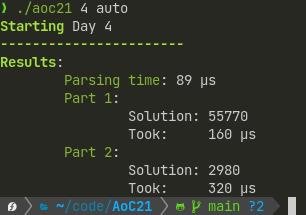

# Advent of Code 2021

)

This repository contains my solutions for the Advent of Code 2021 challanges written in Rust.  
I am currently still learning rust so please dont jude the quality of my code.

## Usage

There are multiple ways to run my solutions, the easiest and most comfortable one is the `auto` command:  
It automatically downloads your input for that it requires you to provide your Advent of Code session id,
which you can find in the website's cookies after logging in.  
Simply provide it by setting the `AOC_SESSION` enviroment variable or using the -s argument:  
`AOC_SESSION=XXXMYSESSION ./aoc21 [DAY] auto` or `./aoc21 [DAY] auto -s XXXMYSESSION`.  
In this example, I set the enviroment variable for the terminal session using `export AOC_SESSION=XXXMYSESSION`, so I can run it without specifiyng the session id again:  
  

If you don't want to automatically download the input, you can also use the `run` command, which uses a locally stored file or stdin input:  
`./aoc21 [DAY] run -f my_input.txt`:  
  

If you just want to run the day's example, simply use the `test` command, as this project already includes the examples:
`./aoc21 [DAY] test`:  
  

## Compiling

This project uses `Cargo`, so compiling is pretty easy:  
`cargo build --release`  
The resulting binary can be found at `./targets/release/aoc21`. You can also directly run the project using `cargo run --release [arguments for aoc21]`  
the `--release` option is not required, but it results in better performance of the solutions.

## Check out other solutions to AoC21

This is just a small selection of solutions from an small community I am part of.

| Repository                                                                            | Language                                |
|---------------------------------------------------------------------------------------|-----------------------------------------|
| [1Turtle's AdventOfCode](https://github.com/1Turtle/AdventOfCode)                     | Lua(2021)                               |
| [andi-make's aoc2021](https://github.com/andi-makes/aoc2021)                          | Rust                                    |
| [Jonas' AdventOfCode2021](https://github.com/J0B10/AdventOfCode2021)                  | Java                                    |
| [DerNiklaas's Advent-Of-Code-2021](https://github.com/derNiklaas/Advent-Of-Code-2021) | Kotlin                                  |
| [Trojaner's AdventofCode2021](https://github.com/TrojanerHD/AdventofCode2021)         | C++                                     |
| [Daan Breur's AdventofCode](https://github.com/daanbreur/AdventofCode)                | Python(2021)                            |
| [Gewi413's AdventOfCode](https://github.com/Gewi413/AdventOfCode)                     | Kotlin                                  |
| [Luftkeks's AdventOfCode](https://github.com/luftkeks/AdventOfCode)                   | Golang(2021)                            |
| [noeppi_noeppi's aoc](https://github.com/noeppi-noeppi/aoc)                           | Assembly, COBOL, Smalltalk, Pascal, ... |
| [NetworkException's AdventOfCode](https://github.com/networkException/AdventOfCode)   | TypeScript                              |
